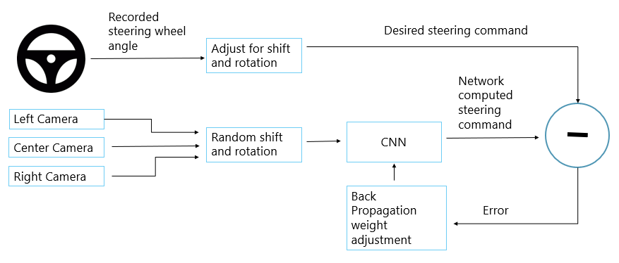

<h1> XCELERATE : SELF DRIVING CAR USING CONVOLUTIONAL NEURAL NETWORK</h1>

<h2>Introduction</h2>

Welcome to the Self-Driving Car Project! This repository contains a complete implementation of a self-driving car system utilizing Convolutional Neural Networks (CNNs). The goal of this project is to develop a prototype that can autonomously navigate a vehicle through different road conditions using visual input from cameras and process it with deep learning models.

<h2>Details</h2>

There are two approaches for the model : 

<ol> 
    <li>Behavioral Cloning</li>
    <li>End to End Learning</li>
</ol>

<h2>Behavioral Cloning</h2>

This approach involves training a CNN to mimic the behavior of a human driver.

<h3>Overview</h3>
<h2>⚙️Tech Stack</h2>

| **Category**                | **Technologies**                                                                                   |
|-----------------------------|----------------------------------------------------------------------------------------------------|
| **Programming Languages**   | **PYTHON**
| **Frameworks**              | **TENSORFLOW, KERAS, FLASK**
| **Libraries**               | **OS, OPENCV, NUMPY, PANDAS, MATPLOTLIB, SKLEARN**
| **Dataset**                 | **[Captured images](https://drive.google.com/drive/folders/1OSidsPlq7MAFSGP0EMvUTuqXh63FEPkH?usp=drive_link), [Csv file mapping images to corresponding steering angles](https://drive.google.com/file/d/1Pzne-S0uWM7XFbQmrdDUNarmUxewPOPV/view?usp=drive_link)**
| **Tools**                   | **GIT, GOOGLE COLAB**

## How it Works

### Data Collection
Data was collected using the Udacity simulator in manual mode by driving around both available tracks. The data includes:
- Center, left, and right camera images
- Corresponding steering angles, throttle, and brake values

### Model Training
A convolutional neural network (CNN) was employed to process the camera images and predict the steering angle. The architecture is based on NVIDIA's self-driving car model.

### Autonomous Driving
The trained model is deployed via a Flask API. In autonomous mode, the simulator sends real-time images to the Flask server, where the model predicts steering angles to control the car.

### Files ###
- `Behavioral_Cloning.ipynb`: Google colab python notebook for data preprocessing collected by manual driving in udacity simulator and training a CNN model to map the images from centre, left and right camera to corresponding steering angle.
- `model.h5` : Model stored in memory after succesfull training of the CNN model
- `app.py` :  Flask API to deploy the trained model in autonomous mode in Udacity Simulator.

### Behavioral Cloning architecture ###

  

https://github.com/user-attachments/assets/9bae5bfc-d7d4-4012-955e-f7b63d766e79

# End to End Learning #
End-to-end learning in self-driving cars refers to a machine learning approach where a single neural network directly maps raw input data, such as images from a camera, to driving actions like steering, acceleration, and braking. This method simplifies the traditional pipeline by eliminating the need for separate components like perception, planning, and control, allowing the model to learn driving behaviors from large datasets of driving scenarios. 

- ## Lane Detection
    ### Overview ###
    The lane detection module is a critical component of the end-to-end learning system for self-driving cars. It utilizes computer vision techniques to identify lane markings on the road, enabling the vehicle to understand its position relative to the lanes and make informed driving decisions.

    ### Key Components ###
    - Image Processing
        - Grayscale conversion
        - Gaussian Blur
        - Canny Edge Detection
    - Hough Line Transform
    - Lane Line Extraction
    - Smoothing and Temporal Analysis
    - Visualization

    ### WorkFlow ###
    - Input Data
    - Preprocessing
    - Line Detection
    - Lane Positioning
    - Output

    ### Files ###
    - `Line.py` : The Line class represents a line segment defined by two endpoints, calculating its slope and y-intercept (bias). It includes methods for coordinate management and drawing the line on images using OpenCV.
    - `lane_detection.py` : This lane detection pipeline processes video frames or images to detect and overlay lane lines using edge detection, Hough transform, and ROI masking. It supports real-time lane smoothing and solid line inference for consistent detection.
    - `main.py` : Implement all the functionalities  of the lane detection module, including data loading, processing, and visualization. It integrates the Lane class with Line class and detects lanes in road images and videos.

- `Demo-Output`

  
    

- ## Traffic Sign Detection ##
    ### Overview ###
    Build a Deep Learning Model using Convolutional Neural Networks (CNN) to classify traffic signs from images. The model will be trained on German Traffic Sign Recognition Benchmark (GTSRB) dataset.  

   ### Workflow ###
    - Data Loading from Dataset
    - Data Preprocessing
    - Model Definition
    - Model Training
    - Model Evaluation
    - Model Deployment
    - Model Visualization

    ### Files ###
     - `SignalDetection.ipynb` :  This Jupyter notebook contains the code for building and training the CNN model for traffic sign detection. It  includes data loading, preprocessing, model definition, training, evaluation, and visualization.

- ## Object Detection ##
    ### Overview ###
     It involves training a convolutional neural network (CNN) to classify objects in images, specifically differentiating between vehicles(cars) and non-vehicles. The dataset is processed, and a custom CNN model is trained to perform detection on images or video.

   ### Key Objectives:
    1. Preprocess vehicle and non-vehicle images.
    2. Train a CNN to classify images.
    3. Detect objects using the trained model.
    4. Evaluate model performance.

    ### Workflow:
    1. Load and preprocess images.
    2. Build and train a CNN.
    3. Use the model for object detection.
    4. Assess accuracy and visualize results.

    ### Files ###
     - `ObjectDetection.ipynb` :  This Jupyter notebook contains the code for building and training the CNN model for Vehicle(mostly cars) and non vehicles. It  includes data loading, preprocessing, model definition, training, evaluation, and visualization.
     
    ### DataSet ### 
     - [Vehicle Images](https://s3.amazonaws.com/udacity-sdc/Vehicle_Tracking/vehicles.zip)

     - [Non-Vehicle Images](https://s3.amazonaws.com/udacity-sdc/Vehicle_Tracking/non-vehicles.zip)

# Self-Driving Car Simulation Using JavaScript

## Overview

This part of project is a comprehensive self-driving car simulation, developed step-by-step as part of an ongoing course. Each phase of the project introduces new features and components, making it progressively more complex and functional. The key components include car driving mechanics, road definition, sensor integration, neural network-based AI, and much more.
This part is divided in two phases

Phase 1 : Car driving mechanics, Road definition, Neural Network train and visualization
Phase 2 : Creating a virtual world and deploying our model on it

## Phase 1 ##

## Key Components

### 1. Car Driving Mechanics

- Implements basic car movement and control logic.
- Allows the car to accelerate, decelerate, and steer left or right.
- Handles basic physics like friction and inertia to simulate real-world driving behavior.

### 2. Road Definition

- Defines road paths using a series of curves and lines.
- Supports various road layouts, from straight highways to curvy tracks.
- The road is rendered on an HTML5 canvas and dynamically updated.

### 3. Artificial Sensors

- Simulates sensors mounted on the car to detect obstacles and road boundaries.
- Multiple sensors are used (front, side, etc.) to gather data about the car’s surroundings.
- These sensors help the car make driving decisions like turning or braking.

### 4. Collision Detection

- Detects collisions with the road boundaries, obstacles, or other vehicles.
- Automatically stops the car or triggers evasive maneuvers when a potential collision is detected.

### 5. Traffic Simulation

- Introduces AI-controlled cars to simulate real-world traffic.
- Ensures the self-driving car can navigate safely in a busy environment.
- Supports basic traffic rules like lane-following, speed limits, and yielding.

### 6. Neural Network

- Implements a simple neural network to process sensor data and control the car's actions.
- The neural network is trained using supervised learning to follow roads and avoid obstacles.

### 7. Visualizing Neural Networks

- Includes a real-time visualization of the neural network’s layers and neuron activations.
- Provides insight into how the network is processing data and making decisions.
  
### 8. Optimizing Neural Networks

- Optimizes the neural network using various techniques like gradient descent and backpropagation.
- Focuses on improving the accuracy of driving decisions through better training and tuning.

### 9. Fine-Tuning

- Refines the car’s performance through fine-tuning techniques such as adjusting hyperparameters.
- Increases the overall smoothness and reliability of the driving experience.

### 10. Live Stream Variant

- Adds functionality for live streaming the simulation to remote clients.
- The live stream variant showcases real-time updates as the car navigates through its environment.

## Virtual World Generator for car to run ##
Here’s an updated README with the new sections based on Phase 2 of the project:

---

# Self-Driving Car Simulation

## Overview

This project is a full-featured self-driving car simulation built in JavaScript, evolving across multiple phases. Phase 2 introduces more advanced features like spatial graphs, dynamic viewport rendering, environment building, and integration with OpenStreetMap. This phase enhances the car’s interaction with a more realistic world, including roads, buildings, and trees, while offering tools for creating and managing the environment.

## Key Components

### 1-10 (Same as previous sections)

## Phase 2 - Advanced Features

### 11. Spatial Graphs

- Introduces spatial graphs to model the road network and its connections.
- Roads, intersections, and junctions are represented as graph nodes and edges.
- Enables efficient pathfinding and navigation through a more structured environment.

### 12. Graph Editor

- A visual editor for creating and modifying spatial graphs.
- Users can place nodes, draw edges, and define custom road layouts within the editor.
- Offers flexibility in designing both simple and complex road networks for the car to navigate.

### 13. Dynamic Viewport

- Implements a dynamic viewport system, allowing the simulation to render only what's visible on the screen.
- Ensures smooth performance by adjusting the rendering area as the car moves through the environment.
- Improves scalability for larger maps and complex road systems.

### 14. Roads

- Defines detailed road geometry, including lanes, junctions, and intersections.
- Roads can be customized with properties like lane width, curvature, and speed limits.
- Allows the car to follow a path through a more realistic road infrastructure.

### 15. Buildings and Trees

- Adds 2D representations of buildings and trees to create a more immersive environment.
- These elements are placed alongside roads to simulate real-world surroundings.
- The environment layout is customizable to suit different simulation needs.

### 16. Fake 3D

- Implements a "fake 3D" effect using 2D rendering techniques, giving the illusion of depth.
- Uses perspective scaling to simulate objects like buildings and trees growing smaller as they move further from the camera.
- Enhances the realism of the driving experience without requiring complex 3D rendering.

### 17. Markings

- Introduces road markings such as lane dividers, crosswalks, and arrows.
- These markings help guide the car along the road and improve its lane-keeping accuracy.
- Markings are dynamically rendered based on road geometry and are customizable within the editor.

### 18. Saving The World

- Allows users to save custom road networks, layouts, and environment setups.
- Provides a "save world" feature where entire simulations, including roads and objects, can be stored and reloaded later.
- This feature is useful for testing different scenarios or sharing custom environments with others.

### 19. Integration

- Integrates external libraries and APIs to expand the simulation's capabilities.
- Phase 2 focuses on integrating the road network and environmental data with external tools like OpenStreetMap.

### 20. OpenStreetMap Integration

- Integrates OpenStreetMap data to generate real-world road networks for the simulation.
- The car can drive on realistic road layouts based on real-world locations.
- Users can select specific areas of the map and import roads, buildings, and landmarks directly into the simulation.

### 21. MiniMap

- Adds a MiniMap feature that provides an overhead view of the entire simulation.
- The MiniMap shows the current position of the car, the road network, and any nearby obstacles or landmarks.
- Useful for tracking the car’s movement and ensuring it stays on course.

<video width="640" height="360" controls>
  <source src="car-output.mp4" type="video/mp4">
  Your browser does not support the video tag.
</video>

     

   

 

